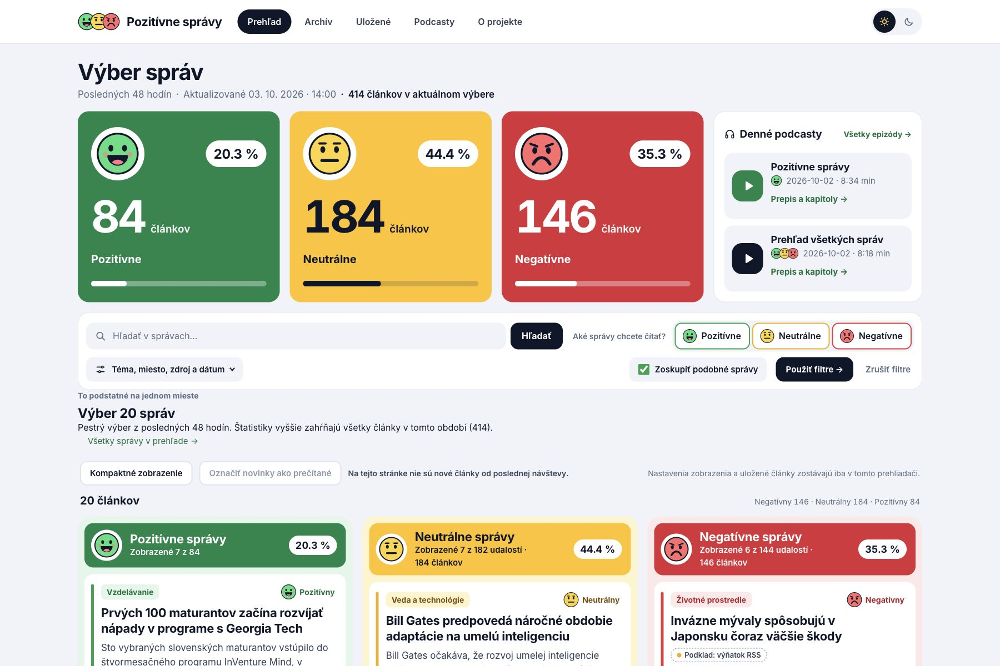
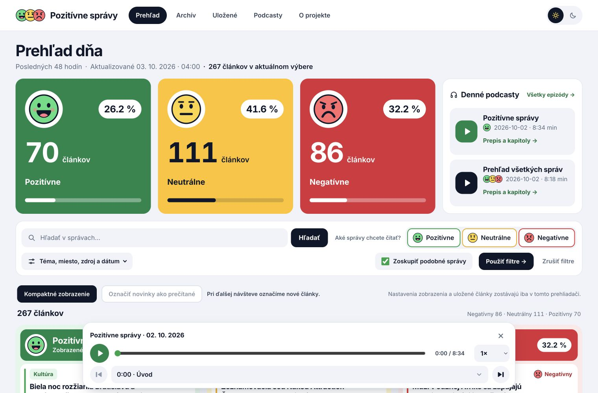
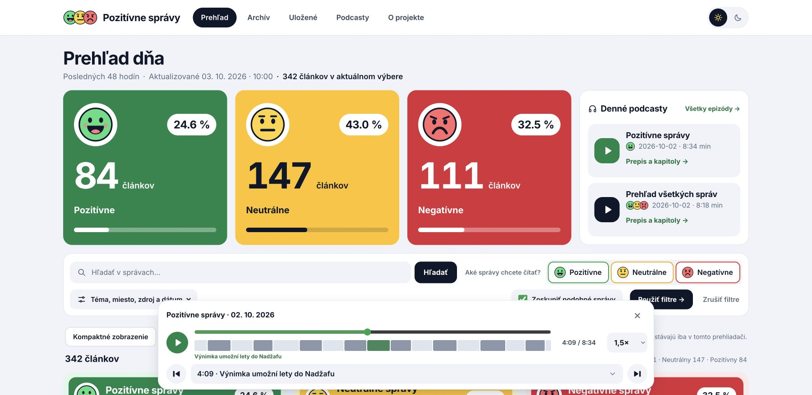
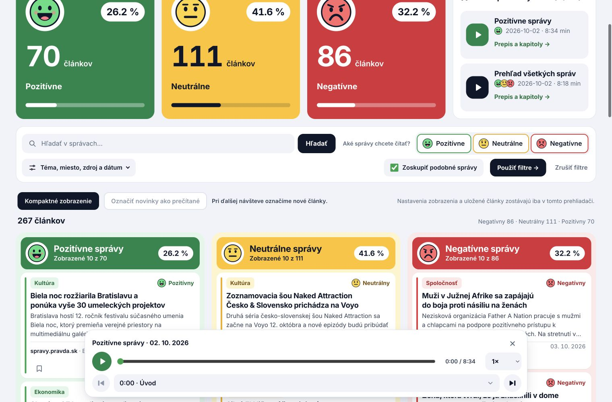
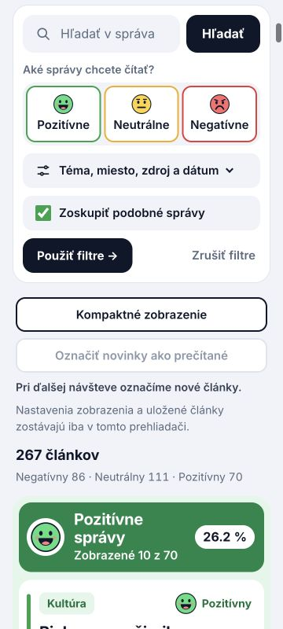
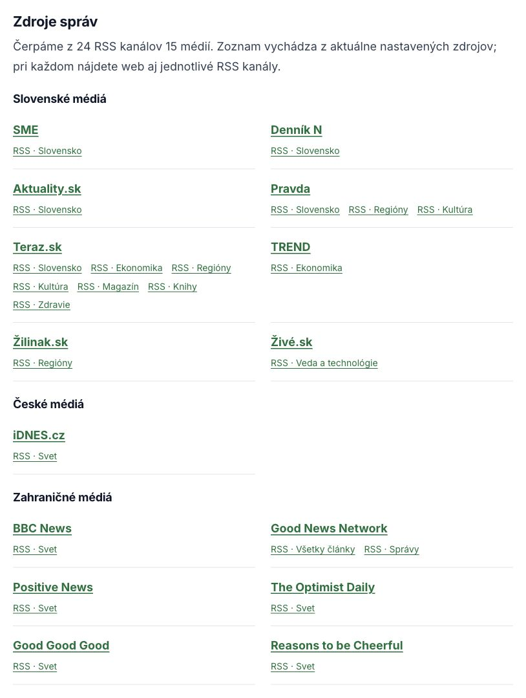

# Pozitívne správy · V2

Slovenský čitateľský web, ktorý zbiera správy z RSS, pripravuje krátke slovenské súhrny pomocou **OpenAI API** a ponúka dva denné podcasty. Pozitívne, neutrálne a negatívne udalosti majú vlastné farby, smajlíky a štatistiky. Sami si vyberiete, čo chcete čítať.

**[Živý web](https://news.mhomeslab.com/)** · **[O projekte](https://news.mhomeslab.com/o-projekte)** · **[Vydania](https://github.com/marek-gresek/pozitivne-spravy/releases)** · **[MIT licencia](LICENSE)**

## Ako vyzerá V2

### Stručný výber 20 správ s prístupom k úplnému zoznamu



### Prehľad na počítači a prehrávač s kapitolami



### Časová os tém podcastu



### Kompaktné čítanie a uloženie na neskôr



### Mobilné ovládanie



### Zdroje správ



Screenshoty zachytávajú verejné rozhranie; počty správ sa priebežne menia.

## Čo projekt robí

- Zbiera články z 24 slovenských, českých a anglických RSS kanálov; nové správy kontroluje každé dve hodiny.
- Na stránke **O projekte** zobrazuje všetkých 15 médií a ich 24 RSS kanálov s odkazmi na weby aj feedy. Zoznam vychádza priamo z konfigurácie zberu správ.
- Pred AI vyberie najviac **80 udalostí denne**, najviac **8 na vydavateľa**. Miesta uvoľňuje postupne v dvojhodinových oknách počas dňa (`Europe/Prague`); nevyužité miesta sa prenášajú v rámci dňa. Opakované pokusy a reštarty nepridávajú nové miesta.
- Bežné správy vyberá najviac 48 hodín od publikovania, zamerané pozitívne zdroje majú sedemdňové okno. Výber zohľadňuje aktuálnosť a rozsah RSS výňatku, pričom strieda kategórie RSS a vydavateľov. Politika, incidenty aj priebežné aktualizácie majú rovnaké podmienky ako ostatné témy; žiadna téma ani pozitívny vydavateľ nedostáva osobitný bonus alebo postih.
- Veľmi podobné udalosti zozbierané pred AI konzervatívne spojí podľa pôvodných titulkov, RSS výňatkov, čísel a času. Vyberie podklad s vyššou prioritou a informatívnejším výňatkom; ďalšie zdroje pripojí po úspešnej analýze. Ide o lokálny odhad podobnosti, ktorý nemusí zachytiť napríklad preklady tej istej udalosti.
- Úvodná stránka ukazuje **20 vybraných správ**; odkaz **Všetky správy** otvorí úplný zoznam. Štatistiky počítajú všetky články vo vybranom období. Archív sa nemaže ani spätne neobmedzuje.
- Pomocou OpenAI API vytvorí slovenský titulok, súhrn, sentiment s vysvetlením, tému, štítky, osoby, organizácie a miesta.
- Ponúka kombinované filtre, vyhľadávanie, textový archív a detail s odkazom na originál. Filtre aj stránkovanie sa dajú zdieľať cez URL.
- V úplnom zozname má každý sentiment samostatné stránkovanie: pri troch neprázdnych kategóriách po 10 kartách, pri dvoch po 15 a pri jednej 30.
- Označí články pridané od poslednej návštevy a umožní označiť novinky ako prečítané. Rozhoduje čas pridania, takže zachytí aj oneskorene spracované články.
- Ikonou záložky uložíte najviac 300 článkov do sekcie **Uložené**. Zoznam aj kompaktné zobrazenie zostávajú v danom prehliadači, bez účtu a synchronizácie medzi zariadeniami. Vymazanie miestneho úložiska odstráni tieto nastavenia.
- Lokálne zoskupí veľmi podobné články o jednej udalosti do rozbaliteľnej karty. Zachová všetky články, ich vlastné súhrny a zdroje. Zoskupenie možno vypnúť vo filtroch; štatistiky vždy počítajú články.
- Zobrazuje dva denné podcasty: pozitívny výber a všeobecný prehľad. Scenáre vznikajú cez OpenAI API; hlas vytvára lokálny **Supertonic 3 M1**.
- Prehrávač podporuje kapitoly, preskakovanie, posúvanie, rýchlosť a pokračovanie pri navigácii. Po úplnom obnovení stránky sa obnoví pozícia bez automatického prehrávania.
- Prehrávač zobrazuje časovú os rozdelenú podľa skutočných dĺžok tém; kliknutie na úsek preskočí na jeho začiatok.
- Audio je skutočné MP3, mono, 44,1 kHz, 64 kb/s. Po **14 dňoch** sa odstráni; prepis, kapitoly a zdrojové odkazy zostávajú.
- Má responzívny vzhľad, svetlú a tmavú tému a súkromnú administráciu so stavom fronty, zdrojov, tokenov a úložiska.

Automatická analýza sa môže pomýliť. Sentiment opisuje udalosť, nie kvalitu média. Úplný kontext treba hľadať v pôvodnom článku.

## Zdroje správ

Aktuálny zoznam je dostupný na [webe · Zdroje správ](https://news.mhomeslab.com/o-projekte#zdroje). Členstvo kanálov určuje `RSS_FEEDS` v [config.py](config.py); stránka ho používa aj na zobrazenie zoznamu. Názvy médií a odkazy na ich weby sú zobrazovacie údaje v [app.py](app.py).

- **Slovenské médiá:** SME, Denník N, Aktuality.sk, Pravda, Teraz.sk, TREND, Žilinak.sk a Živé.sk.
- **České médiá:** iDNES.cz.
- **Zahraničné médiá:** BBC News, Good News Network, Positive News, The Optimist Daily, Good Good Good a Reasons to be Cheerful.

Jedno médium môže mať viac kanálov. Zoznam na webe ukazuje aktuálnu konfiguráciu; dostupnosť jednotlivých feedov sleduje administrácia.

## Architektúra

```text
24 RSS → kandidáti → lokálny výber + duplicity → extrakcia + fronta
                                              ↓
                                      OpenAI Responses API
                                              ↓
                                       SQLite + FTS
                                      ↙           ↘
                               Flask web      podcastový scenár
                                                    ↓
                                              Supertonic 3 M1 → MP3
```

Docker Compose spúšťa **web, jedného pracovníka a interný hlasový server Supertonic**. SQLite s WAL je jediný zdroj pravdy. Verejné čítanie, filtre, kapitoly a vyhľadávanie nevyvolávajú AI požiadavky. Webová služba nemá pripojený API kľúč.

Čitateľské funkcie tiež nevolajú AI. Zoskupovanie konzervatívne porovnáva titulky, sentiment, tému, miesto, čísla, entity a čas publikovania; neprepisuje databázu. Rôzne sentimenty zostávajú oddelené. Podobnosť nemusí zachytiť všetky súvisiace články a môže sa pomýliť, preto sú pôvodné zdroje aj samostatné detaily vždy dostupné. Pri zozname **Uložené** prehliadač pošle iba vybrané verejné identifikátory v hlavičke požiadavky; odpoveď sa verejne neukladá do cache a server nevytvára profil čitateľa. Na uložené články a pamätanie návštevy je potrebný JavaScript a miestne úložisko.

Textová pipeline používa `gpt-6-luna` na bežnú analýzu a `gpt-6.1-sol` na opakované opravy a scenáre, vždy `reasoning.effort: high`. Nasadenie vyžaduje prístup k týmto identifikátorom modelov; ich dostupnosť vo vašom účte si overte pred spustením pracovníka. Modely mimo tohto zoznamu aplikácia odmietne.

Úsporné spracovanie zahŕňa podmienené RSS požiadavky, normalizáciu URL, odtlačky textov, dávky najviac po 16 článkoch s celkovým limitom 60 000 bajtov serializovaných podkladov vrátane rezervy na inštrukcie a jeden spoločný výsledok analýzy. Podklady sa lokálne čistia od opakovaných odsekov a jednoznačných navigačných riadkov. Dlhé texty sa spracujú ako výber kontextu z úvodu, konca a priebežne z celého článku; pôvodný text zostane v archíve. Opravia sa iba neúspešné položky, najprv Lunou a až potom Solom. Oba denné podcastové scenáre vznikajú jedným volaním so spoločnými súhrnmi; každý platný scenár sa uloží samostatne a pri opakovaní audia sa znovu negeneruje. Stream musí byť kompletný a JSON výsledok lokálne overený. Kvóta spracovanie odloží a fronta zostane zachovaná; dočasné chyby majú najviac dva opravné pokusy. Historický archív sa automaticky neposiela znovu na AI.

## Spustenie

Potrebujete Docker s Compose, OpenAI API kľúč s prístupom k nakonfigurovaným modelom a dostatok miesta na hlasový model a pracovné audio. Pri prvom zostavení sa stiahne model Supertonic 3 s mužským hlasom `M1` (približne 400 MB).

```sh
git clone https://github.com/marek-gresek/pozitivne-spravy.git
cd pozitivne-spravy
cp .env.example .env
mkdir -p secrets data
chmod 700 secrets
```

Do súboru **`secrets/ai_key`** bezpečne vložte svoj OpenAI API kľúč. Nevkladajte ho do zdrojového kódu, README, príkazovej histórie ani issue. Potom nastavte práva:

```sh
chmod 600 secrets/ai_key
```

V `.env` nastavte náhodný `SECRET_KEY`. Môžete ho vygenerovať napríklad lokálne cez Python; výsledok uchovajte len v súkromnom `.env`:

```sh
python3 -c 'import secrets; print(secrets.token_hex(32))'
docker compose up -d --build
```

Web bude dostupný na **http://127.0.0.1:5001**. Predvolená adresa OpenAI Responses API je `https://api.openai.com/v1/responses`. Skutočné kľúče a prevádzkové nastavenia sú lokálne a nepatria do Gitu. Pri prvom spustení začne pracovník spracúvať frontu; web dovtedy zobrazuje dostupný obsah a stav čakania.

### Súkromná administrácia

`/admin` vyžaduje Cloudflare Access. V `.env` nastavte vlastné `CF_ACCESS_TEAM`, `CF_ACCESS_AUD` a `SECRET_KEY`. Server overuje podpis RS256, vydavateľa, publikum, platnosť a subjekt JWT; samotná emailová hlavička nestačí. Bez konfigurácie je administrácia uzavretá. Zmeny fronty vyžadujú CSRF token.

Ak web zverejňujete, použite HTTPS a nakonfigurujte ochranu administrácie. Verejný reverzný proxy pripájajte k lokálnemu portu; interný hlasový server Supertonic nevystavujte na internet.

### Plánovanie a retencia

- RSS: všetkých 24 kanálov každé dve hodiny.
- Výber: najviac 80 udalostí za miestny kalendárny deň, najviac 8 od vydavateľa; postupný kumulatívny limit v 12 dvojhodinových oknách. Odložené podklady zostávajú vo fronte do uplynutia ich časového okna, príliš staré sa označia bez AI volania. Denný limit sa týka nových výberov článkov, nie tokenov alebo počtu opráv.
- Obe epizódy: po 09:00 `Europe/Prague`, zo správ predchádzajúceho kalendárneho dňa. Nevybavené dni zostávajú v trvalej fronte aj po výpadku.
- Scenár: najviac 15 lokálne vybraných rozmanitých tém; pri malom počte správ kratšie vydanie.
- Audio: nedostupné po 14 dňoch od publikovania, fyzické čistenie každú hodinu, vrátane poslednej epizódy.
- Opustené pracovné audio: čistenie po 24 hodinách, aktívne generovanie je chránené zámkom.
- Databázové zálohy: denne, uchovanie 14 dní, bez MP3.

Čistenie pracuje len vo vyhradenom adresári a nenasleduje symbolické odkazy. Expirované audio sa neponúka ani pri zlyhaní fyzického mazania. Textové dáta zostávajú zachované.

### Diagnostika

`/healthz` kontroluje web a `/readyz` pripravenosť databázy. Administrácia ukazuje dnešný výber a aktuálne otvorené miesta, kandidátov, duplicity, vyradené podklady a čitateľné dôvody odloženia. Ukazuje aj vstupné, výstupné, cached a reasoning tokeny. Cached tokeny sú súčasťou vstupu a reasoning tokeny sú súčasťou výstupu; do celkového súčtu sa nepripočítavajú druhýkrát. Cena závisí od dostupných modelov a vašej tarify OpenAI API.

Pred ručnými úlohami zastavte pracovníka, aby ste nevytvorili druhý súbežný proces:

```sh
docker compose stop worker
docker compose run --rm --no-deps worker python worker.py collect
docker compose run --rm --no-deps worker python worker.py process --batches 1
docker compose run --rm --no-deps worker python worker.py cleanup
docker compose start worker
```

Ručné vytvorenie epizód podporuje `python worker.py podcasts --day YYYY-MM-DD`. Úlohy `process` a `podcasts` používajú OpenAI API a môžu spotrebovať platené tokeny; `collect` a `cleanup` textovú AI nevolajú.

## Vývoj a testy

```sh
python3 -m venv .venv
. .venv/bin/activate
pip install -r requirements.txt -r requirements-dev.txt
python -m pytest -q
```

Pre testy skutočného MP3 musí byť nainštalovaný `ffmpeg`. Regresný test pamätania návštevy spúšťa produkčný JavaScript cez Node.js; bez Node.js sa tento test preskočí. Testy AI používajú simulované odpovede a nepotrebujú reálny kľúč ani platené volania. Pokrývajú streamovanie, validáciu, tokeny, migráciu, duplicity, frontu, reštart, FTS, filtre, samostatné stránkovanie, autentifikáciu, CSRF, kapitoly a bezpečnú audio retenciu. CI kontroluje testy aj tajomstvá v histórii Gitu.

V2 je nová implementácia webu aj spracovania. `migrate.py` pridáva databázovú schému bez automatickej opätovnej analýzy archívu. Pôvodné spúšťacie skripty zostávajú kompatibilnými vstupmi do pracovníka. Pred prechodom z V1 zastavte starý plánovač a zálohujte databázu.

## Obmedzenia

- Kvalita extrakcie závisí od dostupnosti zdroja; pri použití iba RSS výňatku je článok označený.
- AI hodnotenie a súhrny potrebujú redakčnú kontrolu. Projekt nie je nezávislé overovanie pravdivosti správ.
- Lokálny hlas Supertonic 3 M1 môže znieť synteticky. V2 nesľubuje kvalitu ľudského moderátora.
- Docker pamäťové limity závisia od podpory hostiteľa. Procesový limit virtuálnej pamäte nenahrádza súhrnný limit RAM kontajnera.
- Zdrojový kód neobsahuje živú databázu, článkový archív, audio, súkromnú konfiguráciu ani API kľúče.

## Príspevky a licencia

Nápady a opravy sú vítané cez issues a pull requesty. Pred odoslaním spustite testy a kontrolu tajomstiev podľa [SECURITY.md](SECURITY.md). Bezpečnostný problém s reálnym kľúčom neoznamujte verejným issue.

Kód projektu: **[MIT](LICENSE)**, Marek Grešek. Lokálne fonty Inter a Newsreader majú vlastné SIL Open Font License v `static/fonts/`. Hlasový model Supertonic 3 má samostatnú [licenciu OpenRAIL-M](https://huggingface.co/supertone-oss-archive/supertonic-3/blob/aafc6e32416a594460b32413efc49d7fe4ce6d46/LICENSE); nespadá pod MIT licenciu tohto repozitára. Pôvodné články zostávajú obsahom príslušných vydavateľov.

### Lokálne nahovorenie

Používa sa SDK `supertonic==1.3.1`, hlas `M1`, slovenčina (`sk`), 16 krokov a rýchlosť 1.0. Docker pri zostavení stiahne presnú revíziu modelu `aafc6e32416a594460b32413efc49d7fe4ce6d46` z oficiálneho archívu `supertone-oss-archive/supertonic-3`. Za behu sa modely nesťahujú a nahovorenie nevolá cloud. Server povoľuje iba tento hlas a najviac 600 znakov na požiadavku, jeden proces a jedno vlákno výpočtu (samostatné HTTP vlákno umožňuje kontrolu zdravia počas nahovorenia). Na slabšom CPU môže nahovorenie trvať dlhšie než samotná epizóda; pracovník čaká na hotové audio pred publikovaním. Existujúce vydania sa automaticky nenahrávajú znova.

Pri aktualizácii z Piperu najprv zostavte a overte novú službu `tts`, nechajte dobehnúť rozpracovanú epizódu a potom aktualizujte pracovníka. Pôvodnú službu `piper` odstráňte až po úspešnej kontrole novej služby. DB, audio a 14-dňová retencia zostávajú zachované.
